# Enforcing Least Privilege with IAM Policies (AWS Lab)

In this lab I turned the idea of least privilege into a real setup in AWS. I created a developer user called `alice-dev` who can only work inside one S3 bucket, then tested that she can do her job and nothing else.

## What I built

```
alice-dev  →  FrontendDevelopers (group)  →  AliceDevS3Policy  →  cloudscale-dev-bucket-titi
```

- **Bucket:** `cloudscale-dev-bucket-titi`
- **Policy:** `AliceDevS3Policy` (custom, written by me)
- **Group:** `FrontendDevelopers`
- **User:** `alice-dev`, a member of that group

## Why I wrote my own policy

AWS has a ready-made policy called `AmazonS3FullAccess`, but it lets a user do anything to every bucket in the account. Alice only needs one bucket, so I wrote a custom policy that gives her exactly that and nothing more.

## Step 1: Create the bucket

I opened S3 and created a bucket called `cloudscale-dev-bucket-titi` in the Stockholm region. I left the default settings, which keeps Block Public Access on.

<a href="01-bucket-created.png">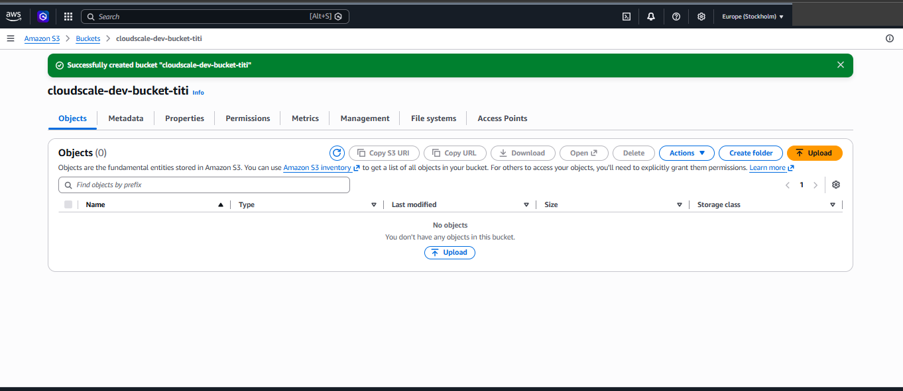</a>

## Step 2: Write the policy

In IAM, I went to Policies, chose Create policy, and pasted the JSON below into the JSON editor.

```json
{
  "Version": "2012-10-17",
  "Statement": [
    {
      "Sid": "AllowViewingBucketListInConsole",
      "Effect": "Allow",
      "Action": ["s3:ListAllMyBuckets", "s3:GetBucketLocation"],
      "Resource": "*"
    },
    {
      "Sid": "AllowListingDevBucketContents",
      "Effect": "Allow",
      "Action": ["s3:ListBucket"],
      "Resource": "arn:aws:s3:::cloudscale-dev-bucket-titi"
    },
    {
      "Sid": "AllowReadingAndWritingFilesInDevBucket",
      "Effect": "Allow",
      "Action": ["s3:GetObject", "s3:PutObject"],
      "Resource": "arn:aws:s3:::cloudscale-dev-bucket-titi/*"
    }
  ]
}
```

What each statement does:

1. **Viewing the bucket list.** `ListAllMyBuckets` and `GetBucketLocation` let the S3 console show bucket names. This one has to use `"Resource": "*"` because AWS doesn't let that action be limited to a single bucket. It only shows names, not contents.
2. **Listing the dev bucket.** `ListBucket` lets Alice see which files are inside her bucket. It uses the bucket's own ARN.
3. **Reading and writing files.** `GetObject` and `PutObject` let her download and upload files. These use the bucket ARN followed by `/*`, which means the objects inside the bucket.

The difference between `bucket` and `bucket/*` matters. Listing applies to the bucket itself, while reading and writing apply to the files inside it, so they need different resource ARNs.

There is no delete action, so Alice can't remove files either.

<a href="02-policy-json-editor.png">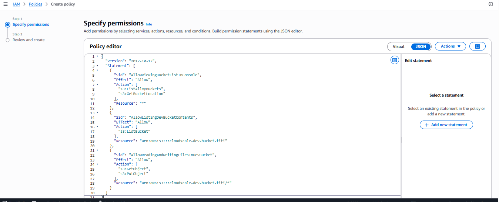</a>

I named it `AliceDevS3Policy` and created it.

<a href="03-policy-created.png">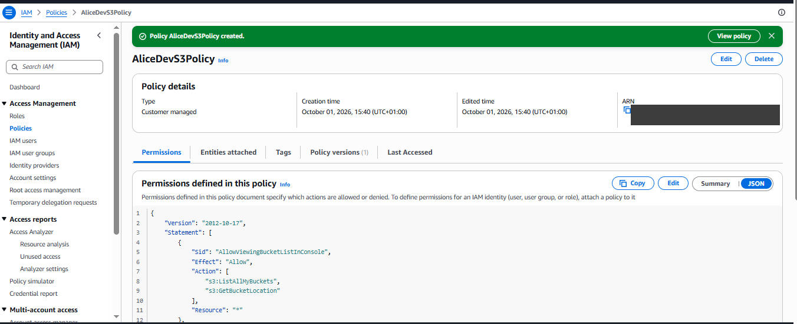</a>

## Step 3: Create the group and the user

I attached the policy to a group instead of directly to Alice. If another frontend developer joins, I only need to add them to the group.

I created the group `FrontendDevelopers` and attached `AliceDevS3Policy` to it.

| Group created | Group details |
|:---:|:---:|
| <a href="04-group-created.png">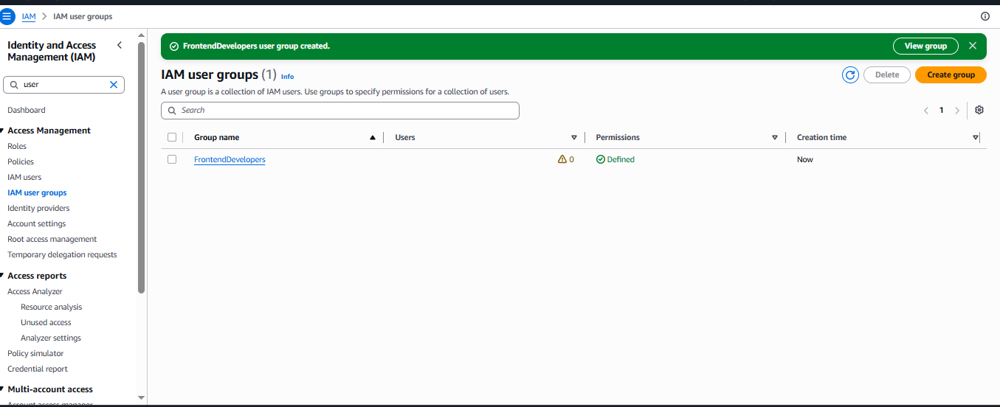</a> | <a href="05-group-details.png">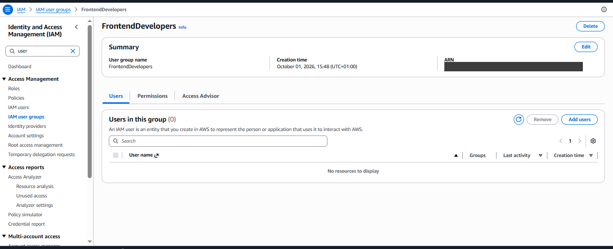</a> |

Then I created the user `alice-dev` with console access and an auto-generated password, and added her to the group.

<a href="06-user-created.png">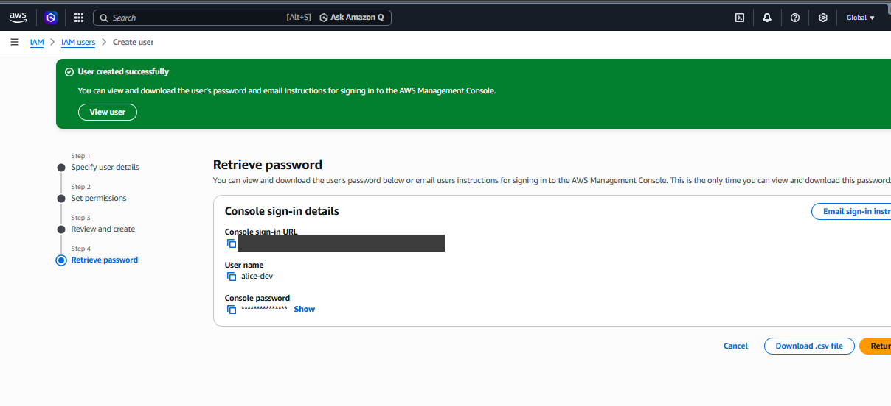</a>

On her user page, `AliceDevS3Policy` shows as attached through the group `FrontendDevelopers`.

<a href="07-user-permissions.png">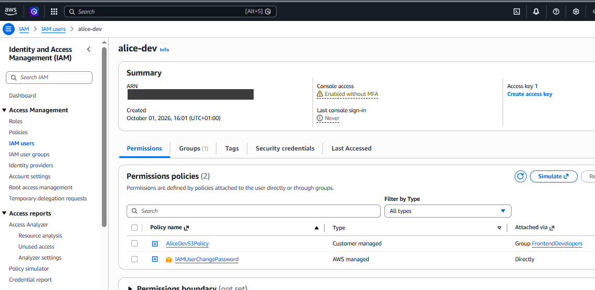</a>

AWS also attached a small managed policy called `IAMUserChangePassword` directly to her. I think this came from the password setting when I created the user. It only lets her change her own password.

## Step 4: Test it

I signed in as `alice-dev` and tried three things.

| Test | Result |
|---|---|
| Upload a file to the dev bucket | Worked |
| Open an uploaded file in the bucket | Worked |
| Create a new S3 bucket | Denied |

**Uploads.** I uploaded two files to `cloudscale-dev-bucket-titi`, and both succeeded. This confirms `s3:PutObject` works.

| First upload | Second upload |
|:---:|:---:|
| <a href="08-alice-upload-docx.png">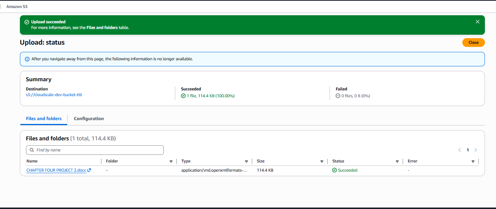</a> | <a href="09-alice-upload-epub.png">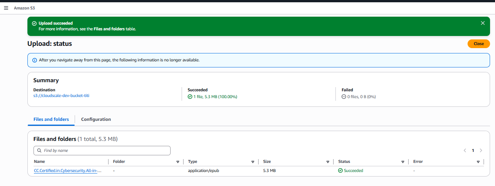</a> |

**Opening a file.** I opened one of the uploaded files to check that Alice can see it in the bucket.

<a href="10-alice-object-view.png">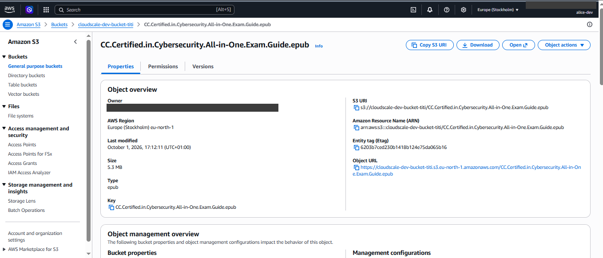</a>

**Creating a bucket.** This failed with the message that the `s3:CreateBucket` permission is required. Alice's policy never allows that action, and AWS denies anything that isn't explicitly allowed, so she is blocked.

<a href="11-alice-create-bucket-denied.png">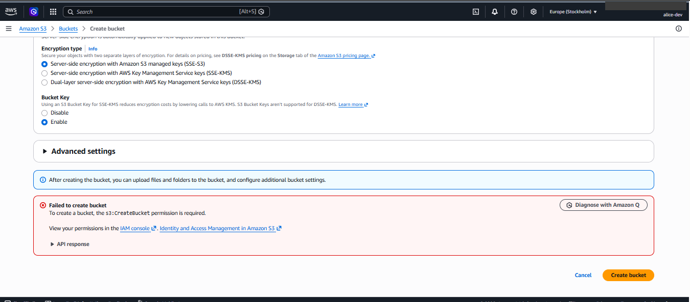</a>

## Things I noticed

- **No MFA.** On Alice's user page, AWS shows "Console access: Enabled without MFA". For a test lab that's fine, but in a real company I would require MFA for every user who can sign in to the console, because a leaked password alone would be enough to get in.
- **The console needed an extra statement.** Without `ListAllMyBuckets`, a user can't see the list of buckets in the S3 console, even if they have access to one of them. That's why the first statement is in the policy.

## What I learned

- Least privilege means writing the policy around the job. Alice gets one bucket and three actions, instead of broad access that she would never use.
- Bucket permissions and file permissions use different ARNs: `bucket` for listing, `bucket/*` for the files inside.
- I didn't have to write any deny rules. AWS blocks everything that isn't allowed, so I only list what Alice needs.
- Policies are easier to manage on groups than on individual users.
